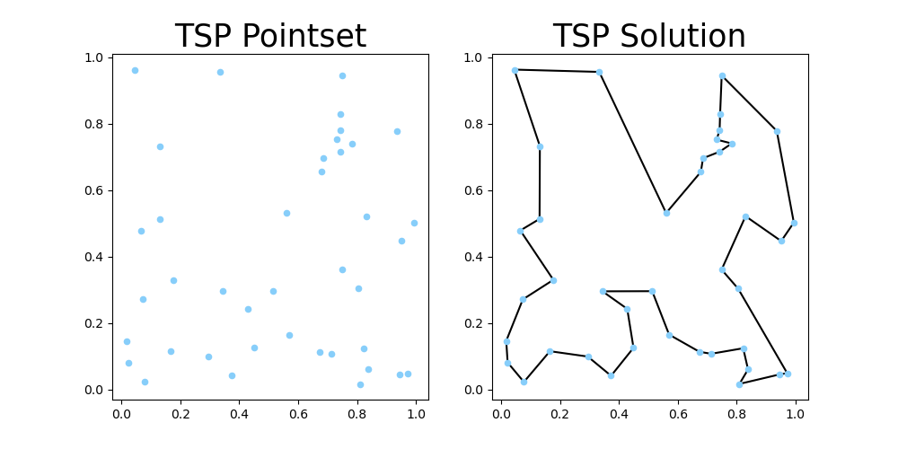

# TSP with Reinforcement Learning
solve TSP problem using reinforcement learning. This repogitory use the [elkai](https://github.com/filipArena/elkai) to generate heuristics dataset for tsp problem.

## Example of TSP dataset generated by elkai

## Results of Reinforcement learning based RNN and Attention model tour length
Results of averaging the tour lengths of a total of 2000 datasets (N is number of pointset)
|Model|N=10|N=20|N=50|
|------|---|---|---|
|elkai|-|-|-|
|RL based RNN|-|-|-|
|RL based Attention|-|-|-|

## Reference
- elkai: https://github.com/fikisipi/elkai
- https://github.com/ita9naiwa/TSP-solver-using-reinforcement-learning
- [Neural Combinatorial Optimization with Reinforcement Learning](http://arxiv.org/abs/1611.09940)
- [Attention, Learn to Solve Routing Problems!](https://openreview.net/forum?id=ByxBFsRqYm)